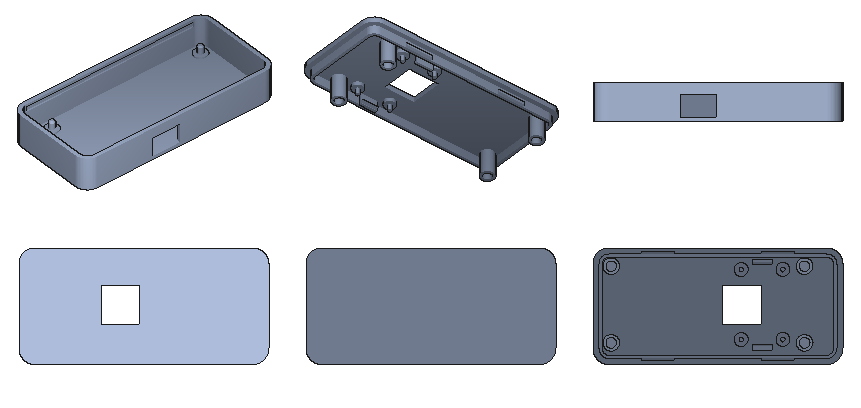

# Case

A printed case for the unit: Raspberry Pi Zero W (or Zero 2 W) with Camera
Module 3. It is meant to hang lens-down over a panel like a document camera,
held by whatever cheap arm is at hand: the back and the ends are flat so a
phone-holder clamp can grip it lengthwise or a rubber band can hold it. The
only opening is the USB port that powers the unit.

`case.py` is the model (parameters at the top), `stl/` the printed parts,
`preview.png` a render. Dimensions come from the official Zero and Camera
Module 3 drawings; the script also checks that a mock Pi and camera clear
the walls, tubes and bosses.



## Parts

| | |
|---|---|
| `stl/body.stl` | Pi on four pegs rising from the floor, one opening for the USB port, a 6 mm pocket at the camera end where the cable U-turns, flat back |
| `stl/lid.stl` | carries the camera lens-out on four pegs and two clips; snaps into the body, and four posts hold the Pi down on the body's pegs |

No screws. Besides the Pi and the camera:

- Raspberry Pi Zero camera cable, 38 mm (the short one sold for the Zero case).

Outer size 75 × 35 × 13.7 mm. The lens housing stands 0.7 mm proud of the lid and the lens tip 4.3 mm, so do not lay the unit lens down on a hard desk. The bottom is flat and closed.

## Printing

No supports. PLA or PETG, 0.2 mm layers, 3 walls. The snap ridges, the camera clips and the pegs are small: 0.4 mm nozzle, no "elephant foot" compensation on the lid's lip.

- `body.stl` open side up, as exported.
- `lid.stl` outer face down, as exported; the four 8.3 mm posts and the clips print upward.

## Assembly

1. Press the Pi onto the four pegs, USB port at the opening. Mini HDMI, PWR IN and the microSD are closed: take the lid off to swap the card. The camera connector end faces the pocket.
2. Press the camera onto the lid's four pegs, lens through the window, connector edge toward the pocket end of the lid, until the two clips snap over its long edges.
3. Plug the 38 mm cable into the Pi (contacts toward the board), fold it up and back over the Pi edge, plug it into the camera (contacts toward the camera board).
4. Lower the lid, lip inside the walls, and press the long sides until the ridges click into the wall grooves. The posts land on the Pi around its holes. To open, pry a long side up at an end.

## Mounting with cheap parts

- A clip-on flexible-arm phone holder (100-yen shops sell them for a few hundred yen): clamp the base to the desk or shelf and let the phone clamp grip the case end to end (75 mm, within the usual 55–85 mm range).
- A tall wire book stand: lash the case to the top with a rubber band, panel at the bottom.

## Changing the model

```
uv venv .venv && . .venv/bin/activate
uv pip install manifold3d numpy pillow
python3 case.py                      # stl/*.stl, preview.png
python3 case.py --copy-to ~/shared   # and a fresh copy of each STL there
```

Everything is a named constant at the top of `case.py`: wall thickness, clearance, where the camera sits (`CAM_BOTTOM_X`), the port opening. The checks print a line per overlap when a change collides with the Pi or the camera.
